# MLB batting vision v2 research deep dive

作成日時: 2026-05-07 21:53:29 JST

この文書は、`fusion_mlb_2024_2026_v2` の研究用出力を、人間が研究判断に使える粒度で読み直すための詳細版です。数値だけでなく、入力データ、モデル、評価単位、サンプル数、VLM caption の失敗傾向まで一つの文書にまとめています。

## 0. 参照元

- Google Drive research output folder: https://drive.google.com/drive/folders/19TWUs3P4dyWELzBywgdAyrkLsW7Ibji7
- Google Drive summary.json: https://drive.google.com/file/d/1N2kQxWsfNZPQOBrlz7l8bVgRDv6nyY4K/view?usp=drivesdk
- Google Drive VLM feature folder: https://drive.google.com/drive/folders/1IGX7gC8qq5nrIxSNsWtC7-YDeHXJrf1y
- Google Drive VLM prediction folder: https://drive.google.com/drive/folders/1bOVX_MRkjsn8tu-EM0rd4cRyhLaa0oZI
- local exported research output used to build this static report: `not included in this GitHub clean copy`
- optional VLM manifest used while building this static report: `not included in this GitHub clean copy`
- optional VLM predictions used while building this static report: `not included in this GitHub clean copy`

## 1. 結論サマリ

### 1.1 何が分かったか

- v2 は Drive 上の v2 namespace を使えている。provenance check は全て ok で、critical id に `_v1` が混ざっていない。
- event-level の公平な同一サンプル比較では、`Raw video DNN fine-tune` が EV / LA / hard-hit / barrel / xBA / xwOBA の 6 target すべてで最良だった。これは「contact-aligned clip の画素そのもの」に強い信号があることを示す。
- all-available 比較では context と fusion が非常に大きい n を持つ。これは網羅性の比較として重要だが、video 系とは母集団が違うため、性能比較は same-sample を必ず併記する。
- player-season では context/fusion が強い。特に同一サンプル比較では、選手年度成績は文脈・過去成績・集約情報の影響が大きく、少数 clip だけの映像特徴ではまだ勝ちにくい。
- VLM は今回 `100 / 687` rows のみ complete。しかも caption/label がかなり一般化し、`open stance / fast load / short stride / straight bat path / early contact` に寄る。研究材料としては面白いが、今回の数値を mechanics 理解の証拠として強く主張するのは危険。
- Pose/TCN は「ピッチャー側 pose を拾うことがある」という目視上の欠点があり、現状の pose 特徴は batter mechanics として不安定。次版では batter selector / crop / pose target association が最優先。

### 1.2 まず見るべき成果物

- `tables/event_same_sample_primary_metrics.csv`: event-level の手法比較で一番フェア。
- `tables/player_same_sample_primary_metrics.csv`: player-season 比較で一番フェア。
- `assets/diagrams/method_flow_corrected_v3.svg`: 入力・派生成果物・教師ラベル・projection・fusion を分けた主図。
- `assets/diagrams/notebook_31_35_artifact_detail.svg`: 31-35 の notebook / artifact / count / format を追う詳細図。
- `assets/diagrams/detailed_method_io_fusion_flow.svg`: 出力行数まで詳しく見る補助図。
- `assets/diagrams/event_same_sample_rank_heatmap.svg`: event-level の勝敗を一枚で見る図。
- `assets/diagrams/player_same_sample_spearman_heatmap.svg`: player-season の順位相関を見る図。
- `tables/vlm_worst_residual_examples.csv`: VLM caption と実際の予測ズレを並べた表。
- `assets/source_figures/method_same_sample_metric_matrix.png`: 既存レポート由来の同一サンプル heatmap。
- `assets/source_figures/contact_frame_sheet.jpg`: 実際にどの contact frame を見ているかの視覚確認。

## 2. データとパイプライン

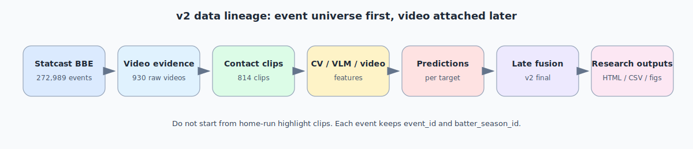

この研究は、動画ページやホームラン集から始めていません。先に Statcast の BBE universe を作り、そこに動画 evidence を後から紐づける設計です。これにより、強い打球やホームランだけに偏ることを避けます。

**図の読み方:** 左から右へ、母集団がどう絞られ、どこで動画・CV・VLM・fusion が入るかを表しています。最重要点は、最初の箱が `Statcast BBE` であり、動画は後から evidence として接続されることです。

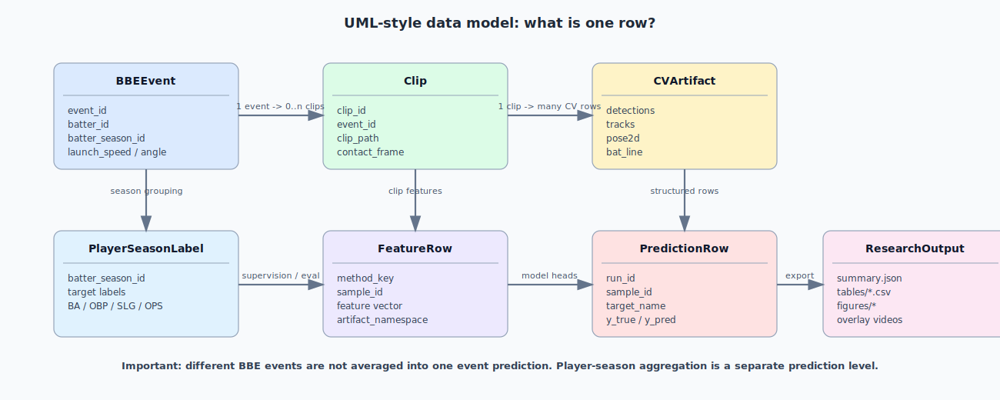

**図の読み方:** `BBEEvent` が研究上の基本単位です。`Clip` は event に紐づく evidence で、`PredictionRow` は `sample_id` と `target_name` を持ちます。別イベントの clip を event-level 予測として平均しない、というルールをこの図で確認できます。

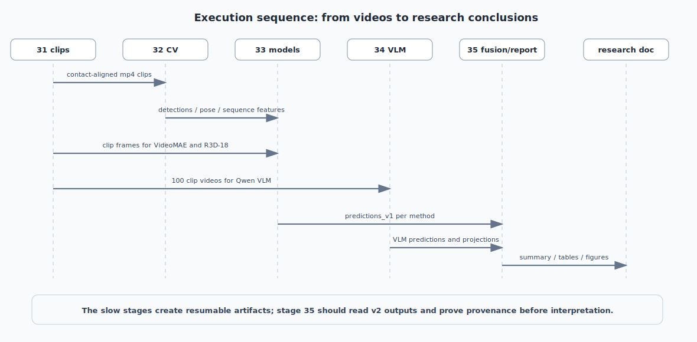

**図の読み方:** notebook 31 から 35 までが、どの成果物を渡しているかを時系列で示しています。遅い処理は中間 artifact に保存され、35 はそれらを読み直して研究出力に変換する段階です。

### 2.1 v2 artifact scale

| artifact | exists | rows/files | Drive path |
| --- | --- | --- | --- |
| Event manifest | True | 272,989 | /content/drive/MyDrive/baseball_vision/manifests/bbe_events_v1.parquet |
| Downloaded videos | True | 930 | /content/drive/MyDrive/baseball_vision/raw_videos/mlb_2024_2026_full_v2/download_manifest_v1.parquet |
| Clips | True | 814 | /content/drive/MyDrive/baseball_vision/clips/mlb_2024_2026_full_v2/clips_v1.parquet |
| Detections | True | 1,180,924 | /content/drive/MyDrive/baseball_vision/detections/mlb_2024_2026_full_v2/detections_v1.parquet |
| Pose skeletons | True | 110,203 | /content/drive/MyDrive/baseball_vision/pose2d/mlb_2024_2026_full_v2/pose2d_v1.parquet |
| Structured sequence manifest | True | 687 | /content/drive/MyDrive/baseball_vision/features/structured_sequence_mlb_2024_2026_v2/manifest.parquet |
| Frozen video embeddings | True | 687 | /content/drive/MyDrive/baseball_vision/features/video_embedding_mlb_2024_2026_v2/manifest.parquet |
| VLM mechanics features | True | 687 | /content/drive/MyDrive/baseball_vision/features/vlm_mechanics_mlb_2024_2026_v2/manifest.parquet |
| Final predictions | True | 1,655,614 | /content/drive/MyDrive/baseball_vision/predictions/fusion_mlb_2024_2026_v2/predictions_v1.parquet |
| Fusion audit | True | 1,723,872 | /content/drive/MyDrive/baseball_vision/predictions/fusion_mlb_2024_2026_v2/fusion_input_audit_v1.parquet |

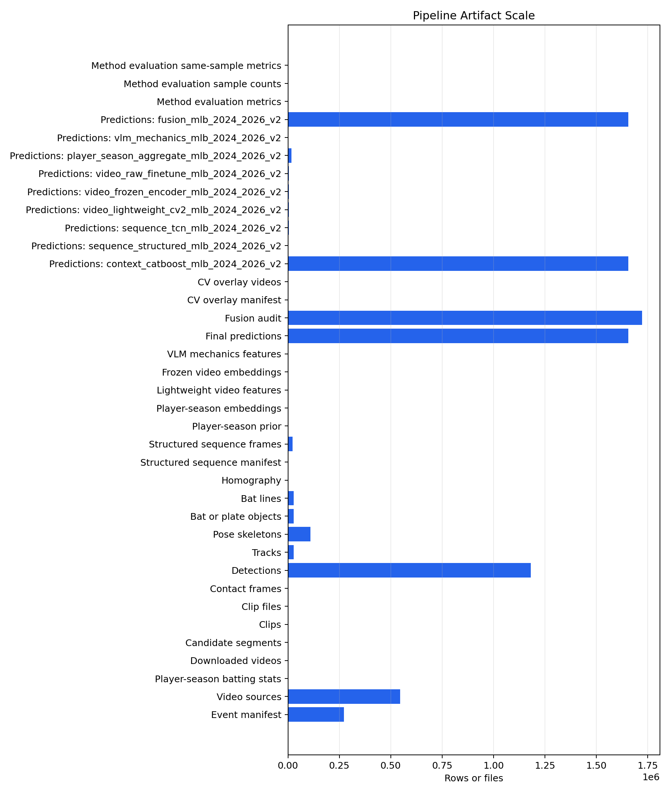

### 2.2 v2 provenance check

| check | status | value | expected |
| --- | --- | --- | --- |
| base_dir_is_baseball_vision | ok | /content/drive/MyDrive/baseball_vision | /content/drive/MyDrive/baseball_vision |
| run_profile_base_dir_matches | ok | /content/drive/MyDrive/baseball_vision | /content/drive/MyDrive/baseball_vision |
| full_run_id_is_v2 | ok | mlb_2024_2026_full_v2 | contains _v2 |
| final_fusion_run_id_is_v2 | ok | fusion_mlb_2024_2026_v2 | contains _v2 |
| all_configured_run_ids_are_v2 | ok | context_run_id=context_catboost_mlb_2024_2026_v2, full_run_id=mlb_2024_2026_full_v2, fusion_run_id=fusion_mlb_2024_2026_v2, method_evaluation_report_id=method_evaluation_mlb_2024_2026_v2, object_detector_run_id=bat_plate_yolo_mlb_2024_2026_v2, player_season_run_id=player_season_aggregate_mlb_2024_2026_v2, recommended_context_run_id=context_catboost_mlb_2024_2026_v2, sequence_run_id=sequence_structured_mlb_2024_2026_v2, sequence_tcn_run_id=sequence_tcn_mlb_2024_2026_v2, video_ablation_report_id=video_ablation_mlb_2024_2026_v2, video_finetune_run_id=video_raw_finetune_mlb_2024_2026_v2, video_frozen_run_id=video_frozen_encoder_mlb_2024_2026_v2, video_lightweight_run_id=video_lightweight_cv2_mlb_2024_2026_v2, video_run_id=video_frozen_encoder_mlb_2024_2026_v2, vlm_run_id=vlm_mechanics_mlb_2024_2026_v2 | every configured run_id contains _v2 |
| report_ids_are_v2 | ok | method_evaluation_report_id=method_evaluation_mlb_2024_2026_v2, video_ablation_report_id=video_ablation_mlb_2024_2026_v2 | report ids contain _v2 |
| all_artifact_namespaces_are_v2 | ok | clip_embedding_feature_id=clip_embedding_mlb_2024_2026_v2, event_with_prior_dataset_id=event_with_player_prior_mlb_2024_2026_v2, image_embedding_feature_id=image_embedding_mlb_2024_2026_v2, player_season_embedding_feature_id=player_season_embedding_mlb_2024_2026_v2, sequence_dataset_id=sequence_dataset_mlb_2024_2026_v2, structured_sequence_feature_id=structured_sequence_mlb_2024_2026_v2, video_embedding_feature_id=video_embedding_mlb_2024_2026_v2, video_lightweight_feature_id=video_lightweight_features_mlb_2024_2026_v2, vlm_feature_id=vlm_mechanics_mlb_2024_2026_v2 | every artifact namespace contains _v2 |
| no_v1_substrings_in_critical_ids | ok |  | no configured run/artifact/report id contains _v1 |
| fusion_source_runs_are_v2 | ok | context_catboost_mlb_2024_2026_v2, context_catboost_mlb_2024_2026_v2_player_season_projection, sequence_tcn_mlb_2024_2026_v2, sequence_tcn_mlb_2024_2026_v2_player_season_projection, video_lightweight_cv2_mlb_2024_2026_v2, video_lightweight_cv2_mlb_2024_2026_v2_player_season_projection, video_frozen_encoder_mlb_2024_2026_v2, video_frozen_encoder_mlb_2024_2026_v2_player_season_projection, video_raw_finetune_mlb_2024_2026_v2, video_raw_finetune_mlb_2024_2026_v2_player_season_projection, player_season_aggregate_mlb_2024_2026_v2, vlm_mechanics_mlb_2024_2026_v2, vlm_mechanics_mlb_2024_2026_v2_player_season_projection | all fusion source_runs contain _v2 and no _v1 |
| fusion_summary_source_runs_match_config | ok | context_catboost_mlb_2024_2026_v2, context_catboost_mlb_2024_2026_v2_player_season_projection, sequence_tcn_mlb_2024_2026_v2, sequence_tcn_mlb_2024_2026_v2_player_season_projection, video_lightweight_cv2_mlb_2024_2026_v2, video_lightweight_cv2_mlb_2024_2026_v2_player_season_projection, video_frozen_encoder_mlb_2024_2026_v2, video_frozen_encoder_mlb_2024_2026_v2_player_season_projection, video_raw_finetune_mlb_2024_2026_v2, video_raw_finetune_mlb_2024_2026_v2_player_season_projection, player_season_aggregate_mlb_2024_2026_v2, vlm_mechanics_mlb_2024_2026_v2, vlm_mechanics_mlb_2024_2026_v2_player_season_projection | fusion summary source_status includes every configured fusion source_run |
| fusion_summary_source_runs_are_v2 | ok | context_catboost_mlb_2024_2026_v2, context_catboost_mlb_2024_2026_v2_player_season_projection, sequence_tcn_mlb_2024_2026_v2, sequence_tcn_mlb_2024_2026_v2_player_season_projection, video_lightweight_cv2_mlb_2024_2026_v2, video_lightweight_cv2_mlb_2024_2026_v2_player_season_projection, video_frozen_encoder_mlb_2024_2026_v2, video_frozen_encoder_mlb_2024_2026_v2_player_season_projection, video_raw_finetune_mlb_2024_2026_v2, video_raw_finetune_mlb_2024_2026_v2_player_season_projection, player_season_aggregate_mlb_2024_2026_v2, vlm_mechanics_mlb_2024_2026_v2, vlm_mechanics_mlb_2024_2026_v2_player_season_projection | fusion summary source_status run ids contain _v2 and no _v1 |
| fusion_config_includes_vlm | ok | context_catboost_mlb_2024_2026_v2, context_catboost_mlb_2024_2026_v2_player_season_projection, sequence_tcn_mlb_2024_2026_v2, sequence_tcn_mlb_2024_2026_v2_player_season_projection, video_lightweight_cv2_mlb_2024_2026_v2, video_lightweight_cv2_mlb_2024_2026_v2_player_season_projection, video_frozen_encoder_mlb_2024_2026_v2, video_frozen_encoder_mlb_2024_2026_v2_player_season_projection, video_raw_finetune_mlb_2024_2026_v2, video_raw_finetune_mlb_2024_2026_v2_player_season_projection, player_season_aggregate_mlb_2024_2026_v2, vlm_mechanics_mlb_2024_2026_v2, vlm_mechanics_mlb_2024_2026_v2_player_season_projection | vlm_mechanics_mlb_2024_2026_v2 |
| fusion_summary_includes_vlm_inputs | ok | vlm_mechanics_mlb_2024_2026_v2 exists=True rows=600, vlm_mechanics_mlb_2024_2026_v2_player_season_projection exists=True rows=580 | VLM prediction and projection sources exist in fusion summary |

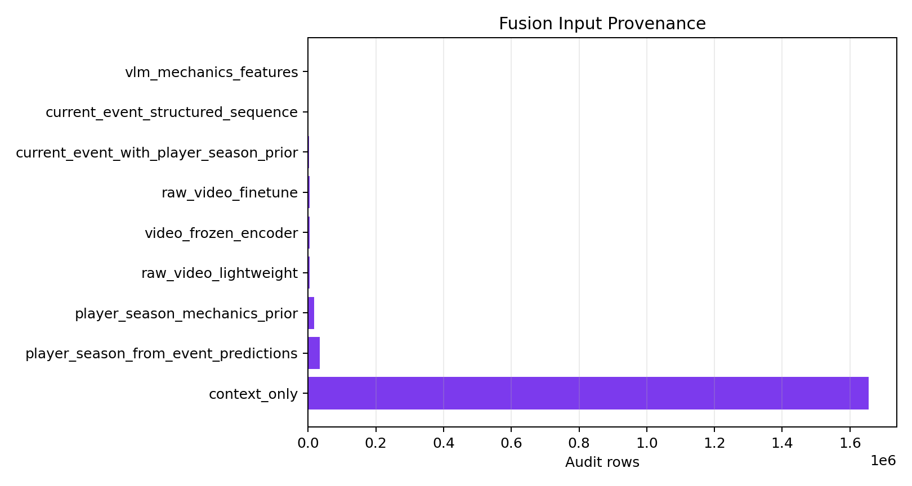

### 2.3 評価対象 target

| target | available | skipped |
| --- | --- | --- |
| ev | 272037 | 952 |
| la | 272187 | 802 |
| hard_hit | 272037 | 952 |
| barrel | 272035 | 954 |
| xba | 268096 | 4893 |
| xwoba | 270916 | 2073 |

EV は打球速度、LA は打球角度です。hard-hit と barrel は二値の接触品質です。xBA と xwOBA は Statcast の expected outcome で、欠損を 0 埋めせず missing として扱います。BA / OBP / SLG / OPS は 1打球イベントではなく player-season target として扱います。

## 3. 手法の全体像

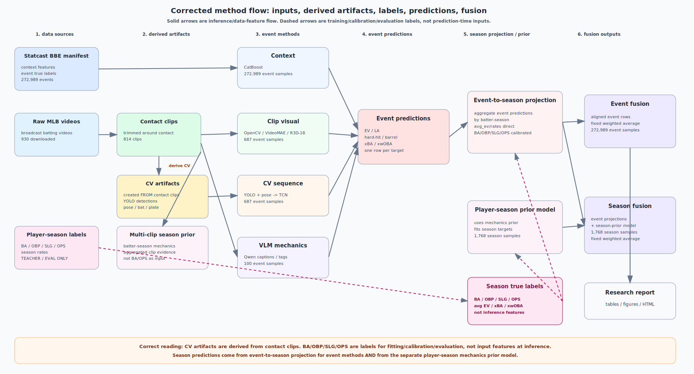

**図の読み方:** これは整合性を優先した主図です。`CV artifacts` は左列の独立入力ではなく、`Contact clips` から派生する中間成果物として描いています。`Player-season labels` は点線で示し、BA/OBP/SLG/OPS が予測時の入力特徴ではなく、学習・calibration・評価のための教師ラベルであることを明示しています。

**重要な読み:** Context は 272,989 event を広く持つ一方、映像系は 687 event 前後、VLM は 100 event です。なので fusion は、映像がある subset では複数手法を統合し、映像がない大多数の event では context が強く効く構造です。

**整合性メモ:** `CV artifacts` は contact clips から作られる中間特徴です。`Season labels` は BA/OBP/SLG/OPS などの教師・評価ラベルで、予測時の入力特徴として渡しているわけではありません。また、player-season 予測は player-season prior だけではなく、event-level の各手法を batter-season ごとに集約し、必要に応じて軽量 calibration する projection run からも作っています。

**実装確認:** `src/sport_pipeline/models/player_season/event_projection.py` は event-level prediction を batter-season ごとに集約し、`avg_ev` などは直接集約、BA/OBP/SLG/OPS は season label に対する calibration で player-season prediction を作ります。`src/sport_pipeline/models/player_season/aggregate_baseline.py` は multi-clip mechanics prior から player-season target を予測し、season stats は `y_true` として評価・学習に使います。

| method | input | model | event samples | event target rows | season samples | season target rows | fusion role |
| --- | --- | --- | --- | --- | --- | --- | --- |
| Context baseline | Statcast BBE context features only | CatBoost/tabular baseline | 272,989 | 1,637,934 | 1,768 | 35,350 | direct source |
| Structured sequence deterministic | Contact-aligned clip features, player-season prior when available | Deterministic structured feature baseline | 394 | 2,364 | 252 | 2,520 | direct source |
| Detection/Tracking/Pose TCN | YOLO/tracking/pose/bat-line structured frame sequence | TCN depth=3 hidden=64 | 687 | 4,122 | 381 | 3,810 | direct source |
| Raw video lightweight | OpenCV lightweight motion/appearance features | Classical CV feature head | 687 | 4,122 | 381 | 3,810 | direct source |
| Raw video frozen encoder | Contact-aligned clip frames | videomae / MCG-NJU/videomae-base-finetuned-kinetics | 687 | 4,122 | 381 | 3,810 | direct source |
| Raw video DNN fine-tune | Raw contact-aligned clip frames | torchvision_r3d18 pretrained=True epochs=5 | 687 | 4,122 | 381 | 3,810 | direct source |
| Player-season mechanics prior | Batter-season mechanics prior features; BA/OBP/SLG/OPS are supervised labels, not runtime input features | Player-season aggregate baseline |  |  | 1,768 | 17,680 | direct source |
| VLM mechanics features | Qwen VLM captions/tags from 100 clips | Qwen/Qwen2.5-VL-3B-Instruct | 100 | 600 | 58 | 580 | direct source |
| Late fusion | Aligned prediction rows from event methods, event-to-season projections, and player-season prior | Weighted average over aligned predictions by event/player-season and target | 272,989 | 1,637,934 | 1,768 | 35,350 | final weighted average |

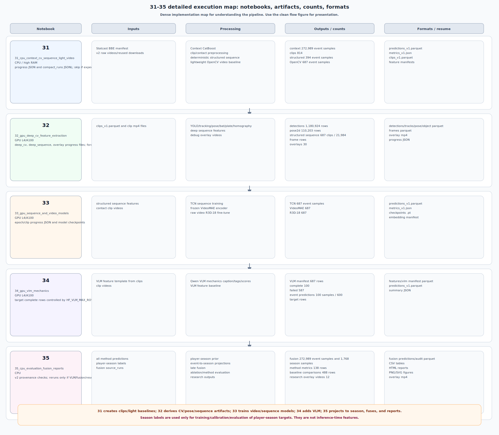

**詳細図の読み方:** これは説明用ではなく、実装理解用の地図です。31-35 の各 wrapper notebook が何を入力し、どの stage を呼び、どの artifact を何行・どの形式で出すかを横並びで整理しています。31-35 全体の再実行順や、どの artifact が次段に渡るかを確認する時に使います。

| notebook | runtime | inputs | processing | outputs | formats | resume/rebuild |
| --- | --- | --- | --- | --- | --- | --- |
| 31_cpu_context_cv_sequence_light_video | CPU / high RAM | Statcast BBE manifest; v2 raw videos/reused downloads | Context CatBoost; clip/contact preprocessing; deterministic structured sequence; lightweight OpenCV video baseline | context 272,989 event samples; clips 814; structured 394 event samples; OpenCV 687 event samples | predictions_v1.parquet; metrics_v1.json; clips_v1.parquet; feature manifests | progress JSON and compact_runs JSONL; skip if expected outputs exist |
| 32_gpu_deep_cv_feature_extraction | GPU L4/A100 | clips_v1.parquet and clip mp4 files | YOLO/tracking/pose/bat/plate/homography; deep sequence features; debug overlay videos | detections 1,180,924 rows; pose2d 110,203 rows; structured sequence 687 clips / 21,984 frame rows; overlays 30 | detections/tracks/pose/object parquet; frames parquet; overlay mp4; progress JSON | deep_cv, deep_sequence, overlay progress files; force flags when pose was incomplete |
| 33_gpu_sequence_and_video_models | GPU L4/A100 | structured sequence features; contact clip videos | TCN sequence training; frozen VideoMAE encoder; raw video R3D-18 fine-tune | TCN 687 event samples; VideoMAE 687; R3D-18 687 | predictions_v1.parquet; metrics_v1.json; checkpoints .pt; embedding manifest | epoch/clip progress JSON and model checkpoints |
| 34_gpu_vlm_mechanics | GPU L4/A100 | VLM feature template from clips; clip videos | Qwen VLM mechanics caption/tags/scores; VLM feature baseline | VLM manifest 687 rows; complete 100; failed 587; event predictions 100 samples / 600 target rows | features/vlm manifest parquet; predictions_v1.parquet; summary JSON | target complete rows controlled by HF_VLM_MAX_ROWS; complete rows reused |
| 35_cpu_evaluation_fusion_reports | CPU | all method predictions; player-season labels; fusion source_runs | player-season prior; event-to-season projections; late fusion; ablation/method evaluation; research outputs | fusion 272,989 event samples and 1,768 season samples; method metrics 138 rows; baseline comparisons 488 rows; research overlay videos 12 | fusion predictions/audit parquet; CSV tables; HTML reports; PNG/SVG figures; overlay mp4 | v2 provenance checks; reruns only if VLM/fusion/research provenance missing |

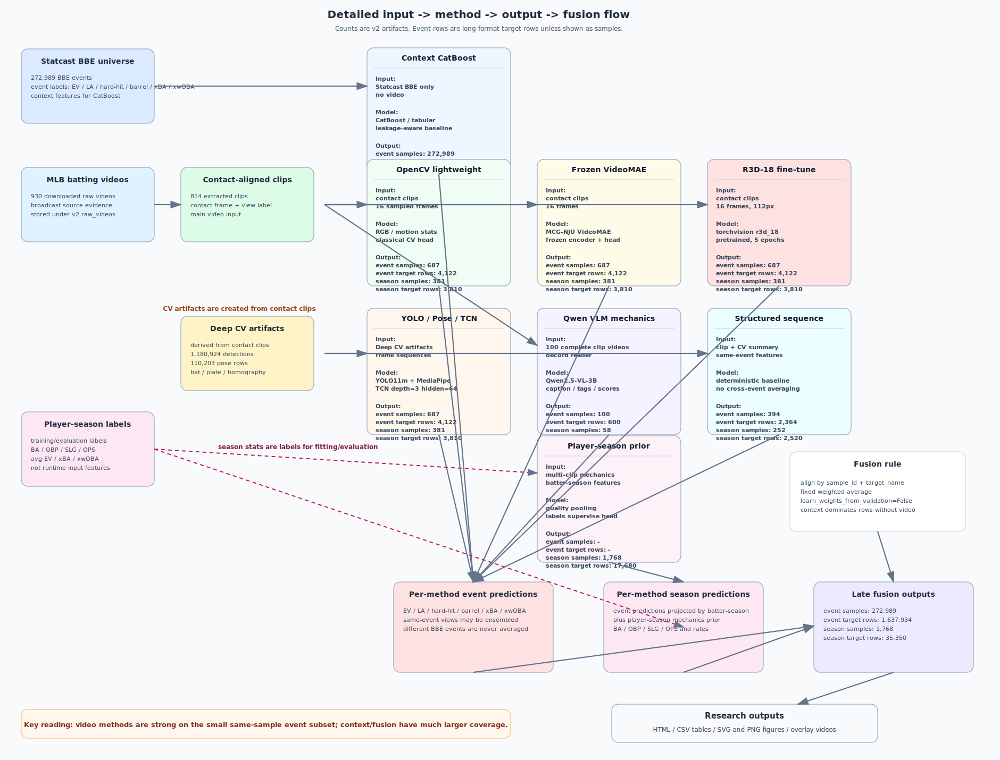

**補助図の読み方:** 上の概要図では省いた `Input / Model / Output` の詳細と target rows を確認するための図です。発表や説明では概要図を主に使い、数を確認したい時だけこの補助図を見るのがよいです。

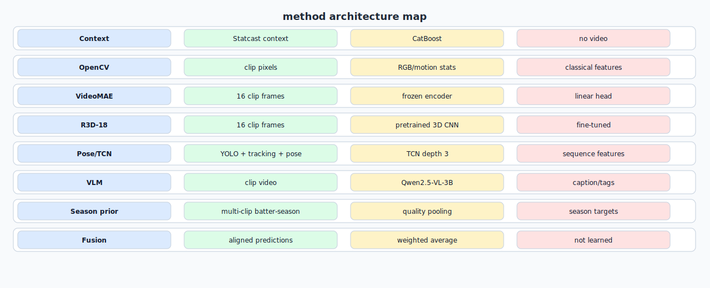

**図の読み方:** 横方向に、各手法の `入力`、`モデル`、`研究上の役割` を並べています。Context は動画を使わない比較対象、VideoMAE/R3D-18 は clip 映像そのもの、Pose/TCN は skeleton と物体系列、VLM は動画を言語化した特徴、Fusion はそれらの予測を後段で混ぜる手法です。

### 3.1 UML-like flow

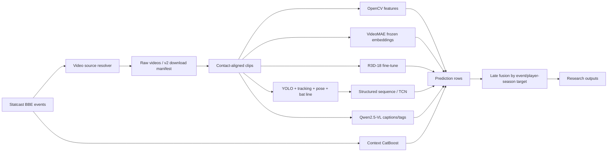
```mermaid
flowchart LR
  A[Statcast BBE events] --> B[Video source resolver]
  B --> C[Raw videos / v2 download manifest]
  C --> D[Contact-aligned clips]
  D --> E1[OpenCV features]
  D --> E2[VideoMAE frozen embeddings]
  D --> E3[R3D-18 fine-tune]
  D --> E4[YOLO + tracking + pose + bat line]
  E4 --> E5[Structured sequence / TCN]
  D --> E6[Qwen2.5-VL captions/tags]
  A --> E7[Context CatBoost]
  E1 --> F[Prediction rows]
  E2 --> F
  E3 --> F
  E5 --> F
  E6 --> F
  E7 --> F
  F --> G[Late fusion by event/player-season target]
  G --> H[Research outputs]
```

### 3.2 Method map

| key | label | family | input | scope | 研究上の問い |
| --- | --- | --- | --- | --- | --- |
| context | Context baseline | tabular_context | Statcast/game/count/pitch/context columns, no batting video pixels | context_only | 映像を見ない時にどこまで当たるか。動画系の下限/比較対象。 |
| structured_sequence | Structured sequence deterministic | pose_object_sequence | clip quality, contact timing, deterministic T x D sequence features | current_event_with_player_season_prior | 検出/姿勢の前に、clip metadata だけで作る mechanics prior がどこまで効くか。 |
| pose_object_tcn | Detection/Tracking/Pose TCN | pose_object_sequence | YOLO detections, ByteTrack ids, pose skeletons, bat line, plate homography over time | current_event_structured_sequence | 検出・追跡・棒人間風 pose/バット/ホームベースを圧縮した時系列だけで予測できるか。 |
| raw_video_lightweight | Raw video lightweight | raw_video | OpenCV RGB/motion statistics from contact-aligned clips | raw_video_lightweight | DNN なしの単純な動画統計に信号があるか。 |
| raw_video_frozen | Raw video frozen encoder | raw_video | VideoMAE/DINO frozen embeddings plus lightweight supervised heads | video_frozen_encoder | 事前学習済み動画/画像 encoder に batting clip を入れるだけで信号が出るか。 |
| raw_video_finetune | Raw video DNN fine-tune | raw_video | contact-aligned RGB frames into tiny 3D CNN or R3D-18 style model | raw_video_finetune | 単純に動画を DNN に入れて end-to-end 学習すると改善するか。 |
| player_season | Player-season mechanics prior | player_season | multi-clip batter-season mechanics embedding | player_season_mechanics_prior | 単打席ではなく、同一選手シーズンの複数 clip から選手 stats を予測できるか。 |
| vlm | VLM mechanics features | vlm | VLM caption / mechanics tags / visual scores extracted from batting clips or contact frames | vlm_mechanics_features | VLM が言語化した stance/load/swing/follow-through などが予測に使えるか。 |
| fusion | Late fusion | fusion | weighted average of available upstream prediction rows | late_fusion_event/player_season | 前段手法を混ぜた時に最終性能が上がるか。ただし context_only が大半になり得るので主表からは通常外す。 |

### 3.3 Model design rows

| method | run_id | level | inputs | model | targets | notes |
| --- | --- | --- | --- | --- | --- | --- |
| Context CatBoost | context_catboost_mlb_2024_2026_v2 | event | Statcast BBE context features only | CatBoost/tabular baseline | EV, LA, hard-hit, barrel, optional xBA/xwOBA | No video evidence; leakage-aware reference baseline. |
| Structured sequence deterministic | sequence_structured_mlb_2024_2026_v2 | event | Contact-aligned clip features, player-season prior when available | Deterministic structured feature baseline | Event Statcast heads | Uses same-event clip features without averaging different BBE events. |
| Sequence TCN | sequence_tcn_mlb_2024_2026_v2 | event | YOLO/tracking/pose/bat-line structured frame sequence | TCN depth=3 hidden=64 | Event Statcast heads | prior_feature_mode=concat_if_available |
| Lightweight video CV | video_lightweight_cv2_mlb_2024_2026_v2 | event | OpenCV lightweight motion/appearance features | Classical CV feature head | Event Statcast heads | Fast video baseline for comparison. |
| Frozen visual encoder | video_frozen_encoder_mlb_2024_2026_v2 | event | Contact-aligned clip frames | videomae / MCG-NJU/videomae-base-finetuned-kinetics | Event Statcast heads | Frozen embedding plus lightweight supervised head. |
| Raw video fine-tune | video_raw_finetune_mlb_2024_2026_v2 | event | Raw contact-aligned clip frames | torchvision_r3d18 pretrained=True epochs=5 | Event Statcast heads | End-to-end video baseline; heavy stage runs on GPU. |
| Player-season mechanics prior | player_season_aggregate_mlb_2024_2026_v2 | player_season | Batter-season mechanics prior features. BA/OBP/SLG/OPS are supervised target labels, not prediction-time inputs. | Player-season aggregate baseline | OPS, OBP, SLG, BA, average EV/LA/xBA/xwOBA, hard-hit/barrel rates | Uses season labels for fitting/evaluation; OPS/OBP/SLG/BA are never event-level heads. |
| VLM mechanics | vlm_mechanics_mlb_2024_2026_v2 | event and projected player_season | Qwen VLM captions/tags from 100 clips | Qwen/Qwen2.5-VL-3B-Instruct | Event Statcast heads via VLM feature baseline | input_mode=clip_video reader=decord fallback_debug_frame=True |
| Late fusion | fusion_mlb_2024_2026_v2 | event and player_season | Aligned prediction rows from event methods, event-to-season projection runs, and the player-season mechanics prior. | Weighted average over aligned predictions by event/player-season and target | All available event and player-season targets | Late fusion averages predictions after alignment; it does not consume raw labels as inference features. |

### 3.4 各モデルを初心者向けに言い換える

#### Context CatBoost

`batter_id`, `pitch_type`, `plate_x`, `plate_z`, `balls`, `strikes`, team など、動画を見なくても分かる表形式データだけで予測します。これは強い比較対象です。なぜなら打球結果はフォームだけでなく、投球・カウント・打者能力にも強く依存するからです。

#### Raw video lightweight / OpenCV

clip から 16 frame を読み、RGB 平均・標準偏差・frame 間差分のような単純な統計を作ります。DNN は使わず、動画に単純な信号があるかを見る軽量 baseline です。今回 EV が極端に悪く、単純統計だけでは不十分でした。

#### Frozen VideoMAE

`MCG-NJU/videomae-base-finetuned-kinetics` を使い、encoder は凍結します。clip の 16 frame を VideoMAE に入れて embedding を出し、その上に軽い supervised head を学習します。動画理解の事前学習が batting に転用できるかを見る手法です。

#### Raw video DNN fine-tune

`torchvision_r3d18` を pretrained=True でロードし、contact-aligned clip frame を直接入力します。設定は 16 frames, 112px, batch size 2, 5 epochs, lr=1e-4 です。今回もっとも強かった event-level 映像手法です。

#### YOLO / tracking / pose / TCN

`yolo11m.pt` で人物や物体を検出し、ByteTrack で track id を持ち、MediaPipe Pose Landmarker Lite で skeleton を作り、bat line / plate / homography と合わせて frame sequence にします。その系列を hidden_dim=64, depth=3 の TCN に入れます。理想はフォームの時系列を読むことですが、現状は pose がバッターでなくピッチャー側に寄ることがあり、信頼性が課題です。

#### VLM mechanics

`Qwen/Qwen2.5-VL-3B-Instruct` に clip video を読ませ、stance/load/stride/bat path/contact timing などの caption/tags を作ります。今回の上限は 100 complete rows です。言語化された mechanics が予測に役立つかを見る探索的手法です。

#### Player-season mechanics prior

同じ batter-season の複数 clip を、1打席の予測平均には使いません。別イベントの予測を1イベントに混ぜると target が壊れるためです。代わりに選手年度の mechanics prior や player-season target の予測に使います。

#### Late fusion

同じ event / batter-season / target にそろった予測だけを重み付き平均します。今回は `learn_weights_from_validation=False` なので、validation から学習した meta-model ではなく、事前に決めた scope weight による late fusion です。

## 4. Fusion の中身

| run_id | exists | rows | path |
| --- | --- | --- | --- |
| context_catboost_mlb_2024_2026_v2 | True | 1655614 | /content/drive/MyDrive/baseball_vision/predictions/context_catboost_mlb_2024_2026_v2/predictions_v1.parquet |
| context_catboost_mlb_2024_2026_v2_player_season_projection | True | 17670 | /content/drive/MyDrive/baseball_vision/predictions/context_catboost_mlb_2024_2026_v2_player_season_projection/predictions_v1.parquet |
| sequence_tcn_mlb_2024_2026_v2 | True | 4122 | /content/drive/MyDrive/baseball_vision/predictions/sequence_tcn_mlb_2024_2026_v2/predictions_v1.parquet |
| sequence_tcn_mlb_2024_2026_v2_player_season_projection | True | 3810 | /content/drive/MyDrive/baseball_vision/predictions/sequence_tcn_mlb_2024_2026_v2_player_season_projection/predictions_v1.parquet |
| video_lightweight_cv2_mlb_2024_2026_v2 | True | 4122 | /content/drive/MyDrive/baseball_vision/predictions/video_lightweight_cv2_mlb_2024_2026_v2/predictions_v1.parquet |
| video_lightweight_cv2_mlb_2024_2026_v2_player_season_projection | True | 3810 | /content/drive/MyDrive/baseball_vision/predictions/video_lightweight_cv2_mlb_2024_2026_v2_player_season_projection/predictions_v1.parquet |
| video_frozen_encoder_mlb_2024_2026_v2 | True | 4122 | /content/drive/MyDrive/baseball_vision/predictions/video_frozen_encoder_mlb_2024_2026_v2/predictions_v1.parquet |
| video_frozen_encoder_mlb_2024_2026_v2_player_season_projection | True | 3810 | /content/drive/MyDrive/baseball_vision/predictions/video_frozen_encoder_mlb_2024_2026_v2_player_season_projection/predictions_v1.parquet |
| video_raw_finetune_mlb_2024_2026_v2 | True | 4122 | /content/drive/MyDrive/baseball_vision/predictions/video_raw_finetune_mlb_2024_2026_v2/predictions_v1.parquet |
| video_raw_finetune_mlb_2024_2026_v2_player_season_projection | True | 3810 | /content/drive/MyDrive/baseball_vision/predictions/video_raw_finetune_mlb_2024_2026_v2_player_season_projection/predictions_v1.parquet |
| player_season_aggregate_mlb_2024_2026_v2 | True | 17680 | /content/drive/MyDrive/baseball_vision/predictions/player_season_aggregate_mlb_2024_2026_v2/predictions_v1.parquet |
| vlm_mechanics_mlb_2024_2026_v2 | True | 600 | /content/drive/MyDrive/baseball_vision/predictions/vlm_mechanics_mlb_2024_2026_v2/predictions_v1.parquet |
| vlm_mechanics_mlb_2024_2026_v2_player_season_projection | True | 580 | /content/drive/MyDrive/baseball_vision/predictions/vlm_mechanics_mlb_2024_2026_v2_player_season_projection/predictions_v1.parquet |

| source | scope | rows | available | mean weight |
| --- | --- | --- | --- | --- |
| context_catboost_mlb_2024_2026_v2 | context_only | 1655614 | 1627308 | 0.7371772647489089 |
| context_catboost_mlb_2024_2026_v2_player_season_projection | player_season_from_event_predictions | 17670 | 17670 | 0.5 |
| player_season_aggregate_mlb_2024_2026_v2 | player_season_mechanics_prior | 17680 | 17674 | 0.7997285067873304 |
| sequence_tcn_mlb_2024_2026_v2 | current_event_structured_sequence | 1758 | 1743 | 0.9914675767918087 |
| sequence_tcn_mlb_2024_2026_v2 | current_event_with_player_season_prior | 2364 | 2347 | 1.092089678510998 |
| sequence_tcn_mlb_2024_2026_v2_player_season_projection | player_season_from_event_predictions | 3810 | 3805 | 0.4993438320209973 |
| video_frozen_encoder_mlb_2024_2026_v2 | video_frozen_encoder | 4122 | 4090 | 0.843401261523532 |
| video_frozen_encoder_mlb_2024_2026_v2_player_season_projection | player_season_from_event_predictions | 3810 | 3805 | 0.4993438320209973 |
| video_lightweight_cv2_mlb_2024_2026_v2 | raw_video_lightweight | 4122 | 4090 | 0.5953420669577874 |
| video_lightweight_cv2_mlb_2024_2026_v2_player_season_projection | player_season_from_event_predictions | 3810 | 3805 | 0.4993438320209973 |
| video_raw_finetune_mlb_2024_2026_v2 | raw_video_finetune | 4122 | 4090 | 0.8930131004366815 |
| video_raw_finetune_mlb_2024_2026_v2_player_season_projection | player_season_from_event_predictions | 3810 | 3805 | 0.4993438320209973 |
| vlm_mechanics_mlb_2024_2026_v2 | vlm_mechanics_features | 600 | 593 | 0.6918333333333334 |
| vlm_mechanics_mlb_2024_2026_v2_player_season_projection | player_season_from_event_predictions | 580 | 578 | 0.4982758620689655 |

fusion は全要素を一つの巨大モデルに入れているわけではありません。各手法が先に `predictions_v1` を出し、同じ target の同じ event/player-season に並ぶものだけを重み付き平均します。したがって、context だけが存在する大量イベントでは fusion はほぼ context になります。一方、video/VLM/pose がある少数イベントでは複数手法の平均になります。

## 5. 評価指標と相関の読み方

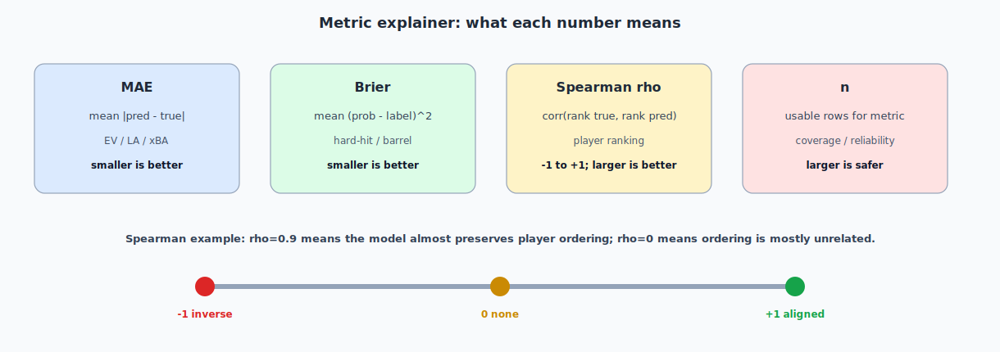

**図の読み方:** MAE と Brier は小さいほど良い損失です。一方、Spearman の相関係数 rho は大きいほど良く、選手を高い順に並べた時の順位がどれだけ合っているかを見ます。n は信頼性の土台で、同じ値でも n=37 と n=270,000 では研究上の重みがまったく違います。

### 5.1 MAE / RMSE

MAE は `平均的にどれくらい外したか` です。EV の MAE=8.50 なら、打球速度を平均 8.5 mph くらい外している、という読みです。RMSE は大外しをより強く罰します。この文書の主表では primary metric として MAE を中心に見ます。

### 5.2 Brier score

hard-hit / barrel は yes/no の確率予測です。Brier score は `予測確率と実際の0/1の二乗誤差` です。0 に近いほど良く、確率が過信して外れると悪化します。

### 5.3 Spearman rho

Spearman は `corr(rank(y_true), rank(y_pred))` です。実数そのものが少しズレていても、選手やイベントの順位が合っていれば高くなります。player-season では `どの選手が上位か` が研究上重要なので、MAE と一緒に Spearman を見る価値があります。

## 6. 結果比較ダッシュボード

この節は、細かい表を読む前に全体感をつかむ場所です。rank heatmap は同一サンプルだけで順位を付けているため、手法比較として最もフェアです。

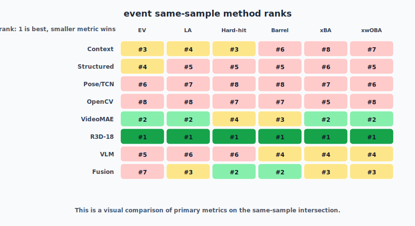

**図の読み方:** 各 cell の `#1` がその target で最良の手法です。event-level では R3D-18 fine-tune が全 target で #1 になっており、今回の v2 では contact-aligned clip の画素情報が最も効いたことを示します。ただしこの比較の n は約 50 なので、追加データで再検証が必要です。

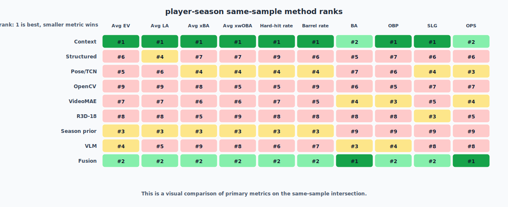

**図の読み方:** player-season では context/fusion が上位に寄ります。これは選手年度成績がフォームだけでなく、打者能力・年度状況・出場機会・PA集計に強く依存するためです。映像系が弱いというより、clip数と batter-specific aggregation の質がまだ不足している、と読むのが自然です。

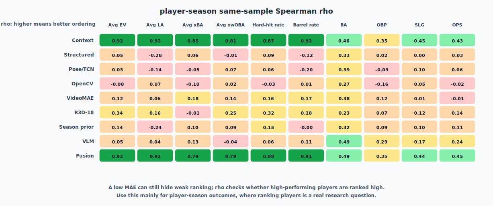

**図の読み方:** 緑に近いほど、選手の順位付けが合っています。context/fusion は Avg EV / Avg LA / barrel rate などでかなり高い相関を持ちます。一方、映像系やVLMはMAEがそこそこでも相関が低い箇所があり、`平均値は近いが誰が上位かは読めていない` 可能性があります。

| method | Avg EV | Avg LA | Avg xBA | Avg xwOBA | Hard-hit rate | Barrel rate | BA | OBP | SLG | OPS |
| --- | --- | --- | --- | --- | --- | --- | --- | --- | --- | --- |
| Context baseline | 0.918 | 0.917 | 0.846 | 0.811 | 0.872 | 0.924 | 0.455 | 0.350 | 0.449 | 0.435 |
| Structured sequence deterministic | 0.046 | -0.283 | 0.059 | -0.005 | 0.090 | -0.118 | 0.331 | 0.018 | 0.003 | 0.032 |
| Detection/Tracking/Pose TCN | 0.032 | -0.142 | -0.048 | 0.066 | 0.059 | -0.204 | 0.393 | -0.034 | 0.104 | 0.056 |
| Raw video lightweight | -0.003 | 0.065 | -0.102 | 0.023 | -0.032 | 0.012 | 0.267 | -0.161 | 0.046 | -0.016 |
| Raw video frozen encoder | 0.116 | 0.061 | 0.179 | 0.143 | 0.160 | 0.166 | 0.376 | 0.122 | 0.011 | -0.011 |
| Raw video DNN fine-tune | 0.335 | 0.162 | -0.008 | 0.252 | 0.318 | 0.184 | 0.228 | 0.068 | 0.124 | 0.140 |
| Player-season mechanics prior | 0.141 | -0.240 | 0.101 | 0.093 | 0.150 | -0.001 | 0.320 | 0.091 | 0.096 | 0.109 |
| VLM mechanics features | 0.049 | 0.045 | 0.132 | -0.043 | 0.060 | 0.112 | 0.495 | 0.290 | 0.167 | 0.241 |
| Late fusion | 0.917 | 0.920 | 0.790 | 0.792 | 0.884 | 0.910 | 0.490 | 0.353 | 0.442 | 0.445 |

### 6.1 比較の要点

- event-level same-sample: `Raw video DNN fine-tune` が EV / LA / hard-hit / barrel / xBA / xwOBA の全 target で最良。
- event-level all-available: context/fusion は n が圧倒的に大きく、coverage の観点で重要。ただし video系との直接比較には使わない。
- player-season same-sample: context/fusion が強い。映像・pose・VLM単独は、選手年度成績の順位付けにはまだ弱い。
- VLM: 100 complete rows しかなく、caption が generic に寄るため、結果の解釈は探索的に留める。

| method | EV | LA | Hard-hit | Barrel | xBA | xwOBA |
| --- | --- | --- | --- | --- | --- | --- |
| Context baseline | 3 | 4 | 3 | 6 | 8 | 7 |
| Structured sequence deterministic | 4 | 5 | 5 | 5 | 6 | 5 |
| Detection/Tracking/Pose TCN | 6 | 7 | 8 | 8 | 7 | 6 |
| Raw video lightweight | 8 | 8 | 7 | 7 | 5 | 8 |
| Raw video frozen encoder | 2 | 2 | 4 | 3 | 2 | 2 |
| Raw video DNN fine-tune | 1 | 1 | 1 | 1 | 1 | 1 |
| VLM mechanics features | 5 | 6 | 6 | 4 | 4 | 4 |
| Late fusion | 7 | 3 | 2 | 2 | 3 | 3 |

| method | Avg EV | Avg LA | Avg xBA | Avg xwOBA | Hard-hit rate | Barrel rate | BA | OBP | SLG | OPS |
| --- | --- | --- | --- | --- | --- | --- | --- | --- | --- | --- |
| Context baseline | 1 | 1 | 1 | 1 | 1 | 1 | 2 | 1 | 1 | 2 |
| Structured sequence deterministic | 6 | 4 | 7 | 7 | 9 | 6 | 5 | 7 | 6 | 6 |
| Detection/Tracking/Pose TCN | 5 | 6 | 4 | 4 | 4 | 4 | 7 | 6 | 4 | 3 |
| Raw video lightweight | 9 | 9 | 8 | 5 | 5 | 9 | 6 | 5 | 7 | 7 |
| Raw video frozen encoder | 7 | 7 | 6 | 6 | 7 | 5 | 4 | 3 | 5 | 4 |
| Raw video DNN fine-tune | 8 | 8 | 5 | 9 | 8 | 8 | 8 | 8 | 3 | 5 |
| Player-season mechanics prior | 3 | 3 | 3 | 3 | 3 | 3 | 9 | 9 | 9 | 9 |
| VLM mechanics features | 4 | 5 | 9 | 8 | 6 | 7 | 3 | 4 | 8 | 8 |
| Late fusion | 2 | 2 | 2 | 2 | 2 | 2 | 1 | 2 | 2 | 1 |

## 7. Event-level results

### 7.1 all-available primary metric

下表は各手法が持つ全 available row での評価です。n が大きく違うため、性能の直接比較には注意が必要です。

| method | EV | LA | Hard-hit | Barrel | xBA | xwOBA |
| --- | --- | --- | --- | --- | --- | --- |
| Context baseline | 9.63 | 20.32 | 0.196 | 0.070 | 0.236 | 0.282 |
| Structured sequence deterministic | 10.80 | 15.02 | 0.235 | 0.181 | 0.246 | 0.365 |
| Detection/Tracking/Pose TCN | 13.12 | 15.79 | 0.260 | 0.183 | 0.250 | 0.355 |
| Raw video lightweight | 90.59 | 20.84 | 0.249 | 0.266 | 0.254 | 0.555 |
| Raw video frozen encoder | 10.39 | 13.12 | 0.195 | 0.127 | 0.232 | 0.291 |
| Raw video DNN fine-tune | 9.64 | 11.94 | 0.113 | 0.045 | 0.187 | 0.243 |
| VLM mechanics features | 11.91 | 13.05 | 0.237 | 0.197 | 0.215 | 0.393 |
| Late fusion | 9.64 | 20.32 | 0.196 | 0.070 | 0.236 | 0.282 |

### 7.2 all-available n

| method | EV | LA | Hard-hit | Barrel | xBA | xwOBA |
| --- | --- | --- | --- | --- | --- | --- |
| Context baseline | 272,037 | 272,187 | 272,037 | 272,035 | 268,096 | 270,916 |
| Structured sequence deterministic | 392 | 393 | 392 | 392 | 386 | 392 |
| Detection/Tracking/Pose TCN | 684 | 685 | 684 | 684 | 672 | 681 |
| Raw video lightweight | 684 | 685 | 684 | 684 | 672 | 681 |
| Raw video frozen encoder | 684 | 685 | 684 | 684 | 672 | 681 |
| Raw video DNN fine-tune | 684 | 685 | 684 | 684 | 672 | 681 |
| VLM mechanics features | 99 | 100 | 99 | 99 | 98 | 98 |
| Late fusion | 272,037 | 272,187 | 272,037 | 272,035 | 268,096 | 270,916 |

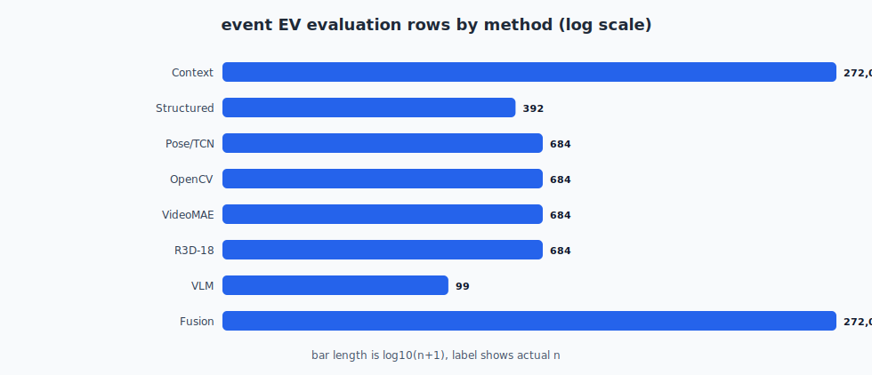

**図の読み方:** 棒の長さは log scale なので、context の 27万行と映像系の 600行台を同じ図で見られます。ラベルの数字が実際の n です。ここから、all-available の性能差は `手法差` と `母集団差` が混ざることが分かります。

### 7.3 all-available winner

| target | best | metric | value | n |
| --- | --- | --- | --- | --- |
| EV | Context baseline | mae | 9.63 | 272,037 |
| LA | Raw video DNN fine-tune | mae | 11.94 | 685 |
| Hard-hit | Raw video DNN fine-tune | brier | 0.113 | 684 |
| Barrel | Raw video DNN fine-tune | brier | 0.045 | 684 |
| xBA | Raw video DNN fine-tune | mae | 0.187 | 672 |
| xwOBA | Raw video DNN fine-tune | mae | 0.243 | 681 |

### 7.4 same-sample primary metric

ここが event-level 手法比較で一番重要です。同じサンプルに全手法が予測を持つ場合だけで比べています。

| method | EV | LA | Hard-hit | Barrel | xBA | xwOBA |
| --- | --- | --- | --- | --- | --- | --- |
| Context baseline | 9.98 | 10.66 | 0.176 | 0.218 | 0.294 | 0.475 |
| Structured sequence deterministic | 11.53 | 12.08 | 0.236 | 0.212 | 0.210 | 0.414 |
| Detection/Tracking/Pose TCN | 12.34 | 12.68 | 0.268 | 0.268 | 0.221 | 0.437 |
| Raw video lightweight | 94.76 | 17.33 | 0.245 | 0.262 | 0.207 | 0.746 |
| Raw video frozen encoder | 9.26 | 8.04 | 0.190 | 0.161 | 0.194 | 0.335 |
| Raw video DNN fine-tune | 8.50 | 7.59 | 0.081 | 0.009 | 0.146 | 0.198 |
| VLM mechanics features | 11.80 | 12.41 | 0.237 | 0.203 | 0.204 | 0.413 |
| Late fusion | 15.16 | 9.49 | 0.174 | 0.137 | 0.196 | 0.352 |

### 7.5 same-sample n

| method | EV | LA | Hard-hit | Barrel | xBA | xwOBA |
| --- | --- | --- | --- | --- | --- | --- |
| Context baseline | 50 | 51 | 50 | 50 | 50 | 50 |
| Structured sequence deterministic | 50 | 51 | 50 | 50 | 50 | 50 |
| Detection/Tracking/Pose TCN | 50 | 51 | 50 | 50 | 50 | 50 |
| Raw video lightweight | 50 | 51 | 50 | 50 | 50 | 50 |
| Raw video frozen encoder | 50 | 51 | 50 | 50 | 50 | 50 |
| Raw video DNN fine-tune | 50 | 51 | 50 | 50 | 50 | 50 |
| VLM mechanics features | 50 | 51 | 50 | 50 | 50 | 50 |
| Late fusion | 50 | 51 | 50 | 50 | 50 | 50 |

### 7.6 same-sample winner

| target | best | metric | value | n |
| --- | --- | --- | --- | --- |
| EV | Raw video DNN fine-tune | mae | 8.50 | 50 |
| LA | Raw video DNN fine-tune | mae | 7.59 | 51 |
| Hard-hit | Raw video DNN fine-tune | brier | 0.081 | 50 |
| Barrel | Raw video DNN fine-tune | brier | 0.009 | 50 |
| xBA | Raw video DNN fine-tune | mae | 0.146 | 50 |
| xwOBA | Raw video DNN fine-tune | mae | 0.198 | 50 |

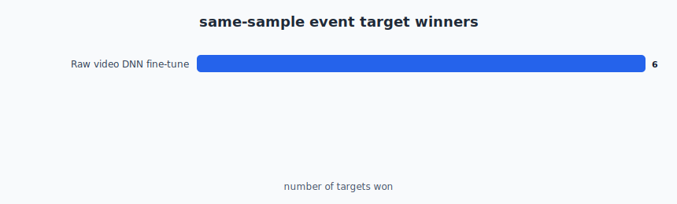

**図の読み方:** same-sample の target 別勝者数です。今回は R3D-18 fine-tune が6勝で、イベント予測では最重要候補です。ただし n=50前後の狭い共通集合なので、強い主張には拡張実験が必要です。

**図の読み方:** heatmap は target と手法を一枚で見ます。色が良いほど primary metric が良い、という直感図です。数値の厳密比較は上の表、全体の傾向把握はこの図、という使い分けです。

読み方: EV / LA / xBA / xwOBA は MAE なので小さいほど良いです。hard-hit / barrel は Brier score なので、これも小さいほど良いです。same-sample では Raw video DNN fine-tune が全 target で最良です。これは今回の v2 の最大の研究上の発見です。

## 8. Player-season results

### 8.1 all-available primary metric

| method | Avg EV | Avg LA | Avg xBA | Avg xwOBA | Hard-hit rate | Barrel rate | BA | OBP | SLG | OPS |
| --- | --- | --- | --- | --- | --- | --- | --- | --- | --- | --- |
| Context baseline | 1.95 | 3.85 | 0.035 | 0.049 | 0.054 | 0.028 | 0.040 | 0.046 | 0.073 | 0.109 |
| Structured sequence deterministic | 5.87 | 4.01 | 0.205 | 0.308 | 0.238 | 0.166 | 0.027 | 0.032 | 0.062 | 0.088 |
| Detection/Tracking/Pose TCN | 5.17 | 5.42 | 0.176 | 0.138 | 0.079 | 0.076 | 0.026 | 0.031 | 0.061 | 0.085 |
| Raw video lightweight | 88.09 | 12.90 | 0.230 | 0.301 | 0.128 | 0.443 | 0.026 | 0.031 | 0.061 | 0.085 |
| Raw video frozen encoder | 6.53 | 7.35 | 0.177 | 0.253 | 0.196 | 0.114 | 0.026 | 0.030 | 0.060 | 0.083 |
| Raw video DNN fine-tune | 11.36 | 12.26 | 0.178 | 0.334 | 0.265 | 0.209 | 0.026 | 0.031 | 0.059 | 0.083 |
| Player-season mechanics prior | 2.93 | 5.37 | 0.040 | 0.058 | 0.087 | 0.044 | 0.046 | 0.051 | 0.091 | 0.132 |
| VLM mechanics features | 5.63 | 4.28 | 0.242 | 0.379 | 0.175 | 0.202 | 0.021 | 0.028 | 0.058 | 0.073 |
| Late fusion | 3.20 | 4.36 | 0.045 | 0.056 | 0.067 | 0.041 | 0.041 | 0.047 | 0.077 | 0.114 |

### 8.2 all-available n

| method | Avg EV | Avg LA | Avg xBA | Avg xwOBA | Hard-hit rate | Barrel rate | BA | OBP | SLG | OPS |
| --- | --- | --- | --- | --- | --- | --- | --- | --- | --- | --- |
| Context baseline | 1,767 | 1,767 | 1,767 | 1,767 | 1,767 | 1,767 | 1,767 | 1,767 | 1,767 | 1,767 |
| Structured sequence deterministic | 252 | 252 | 251 | 252 | 252 | 252 | 252 | 252 | 252 | 252 |
| Detection/Tracking/Pose TCN | 381 | 381 | 378 | 379 | 381 | 381 | 381 | 381 | 381 | 381 |
| Raw video lightweight | 381 | 381 | 378 | 379 | 381 | 381 | 381 | 381 | 381 | 381 |
| Raw video frozen encoder | 381 | 381 | 378 | 379 | 381 | 381 | 381 | 381 | 381 | 381 |
| Raw video DNN fine-tune | 381 | 381 | 378 | 379 | 381 | 381 | 381 | 381 | 381 | 381 |
| Player-season mechanics prior | 1,767 | 1,767 | 1,767 | 1,767 | 1,767 | 1,767 | 1,768 | 1,768 | 1,768 | 1,768 |
| VLM mechanics features | 58 | 58 | 57 | 57 | 58 | 58 | 58 | 58 | 58 | 58 |
| Late fusion | 3,534 | 3,534 | 3,534 | 3,534 | 3,534 | 3,534 | 3,535 | 3,535 | 3,535 | 3,535 |

### 8.3 all-available winner

| target | best | metric | value | n |
| --- | --- | --- | --- | --- |
| Avg EV | Context baseline | mae | 1.95 | 1,767 |
| Avg LA | Context baseline | mae | 3.85 | 1,767 |
| Avg xBA | Context baseline | mae | 0.035 | 1,767 |
| Avg xwOBA | Context baseline | mae | 0.049 | 1,767 |
| Hard-hit rate | Context baseline | mae | 0.054 | 1,767 |
| Barrel rate | Context baseline | mae | 0.028 | 1,767 |
| BA | VLM mechanics features | mae | 0.021 | 58 |
| OBP | VLM mechanics features | mae | 0.028 | 58 |
| SLG | VLM mechanics features | mae | 0.058 | 58 |
| OPS | VLM mechanics features | mae | 0.073 | 58 |

### 8.4 same-sample primary metric

| method | Avg EV | Avg LA | Avg xBA | Avg xwOBA | Hard-hit rate | Barrel rate | BA | OBP | SLG | OPS |
| --- | --- | --- | --- | --- | --- | --- | --- | --- | --- | --- |
| Context baseline | 0.89 | 1.81 | 0.014 | 0.022 | 0.019 | 0.013 | 0.018 | 0.023 | 0.038 | 0.050 |
| Structured sequence deterministic | 6.11 | 4.30 | 0.211 | 0.318 | 0.249 | 0.177 | 0.020 | 0.025 | 0.049 | 0.064 |
| Detection/Tracking/Pose TCN | 5.60 | 5.60 | 0.186 | 0.141 | 0.080 | 0.071 | 0.021 | 0.024 | 0.048 | 0.063 |
| Raw video lightweight | 88.04 | 11.83 | 0.235 | 0.294 | 0.129 | 0.452 | 0.021 | 0.024 | 0.049 | 0.064 |
| Raw video frozen encoder | 6.78 | 7.17 | 0.209 | 0.310 | 0.193 | 0.126 | 0.020 | 0.024 | 0.049 | 0.063 |
| Raw video DNN fine-tune | 11.21 | 9.41 | 0.204 | 0.419 | 0.224 | 0.210 | 0.021 | 0.025 | 0.047 | 0.063 |
| Player-season mechanics prior | 2.15 | 4.29 | 0.026 | 0.039 | 0.065 | 0.030 | 0.024 | 0.029 | 0.060 | 0.082 |
| VLM mechanics features | 4.72 | 4.34 | 0.241 | 0.368 | 0.158 | 0.186 | 0.019 | 0.024 | 0.050 | 0.065 |
| Late fusion | 0.91 | 1.81 | 0.015 | 0.023 | 0.019 | 0.014 | 0.018 | 0.024 | 0.038 | 0.050 |

### 8.5 same-sample n

| method | Avg EV | Avg LA | Avg xBA | Avg xwOBA | Hard-hit rate | Barrel rate | BA | OBP | SLG | OPS |
| --- | --- | --- | --- | --- | --- | --- | --- | --- | --- | --- |
| Context baseline | 37 | 37 | 37 | 37 | 37 | 37 | 37 | 37 | 37 | 37 |
| Structured sequence deterministic | 37 | 37 | 37 | 37 | 37 | 37 | 37 | 37 | 37 | 37 |
| Detection/Tracking/Pose TCN | 37 | 37 | 37 | 37 | 37 | 37 | 37 | 37 | 37 | 37 |
| Raw video lightweight | 37 | 37 | 37 | 37 | 37 | 37 | 37 | 37 | 37 | 37 |
| Raw video frozen encoder | 37 | 37 | 37 | 37 | 37 | 37 | 37 | 37 | 37 | 37 |
| Raw video DNN fine-tune | 37 | 37 | 37 | 37 | 37 | 37 | 37 | 37 | 37 | 37 |
| Player-season mechanics prior | 37 | 37 | 37 | 37 | 37 | 37 | 37 | 37 | 37 | 37 |
| VLM mechanics features | 37 | 37 | 37 | 37 | 37 | 37 | 37 | 37 | 37 | 37 |
| Late fusion | 37 | 37 | 37 | 37 | 37 | 37 | 37 | 37 | 37 | 37 |

### 8.6 same-sample winner

| target | best | metric | value | n |
| --- | --- | --- | --- | --- |
| Avg EV | Context baseline | mae | 0.89 | 37 |
| Avg LA | Context baseline | mae | 1.81 | 37 |
| Avg xBA | Context baseline | mae | 0.014 | 37 |
| Avg xwOBA | Context baseline | mae | 0.022 | 37 |
| Hard-hit rate | Context baseline | mae | 0.019 | 37 |
| Barrel rate | Context baseline | mae | 0.013 | 37 |
| BA | Late fusion | mae | 0.018 | 37 |
| OBP | Context baseline | mae | 0.023 | 37 |
| SLG | Context baseline | mae | 0.038 | 37 |
| OPS | Late fusion | mae | 0.050 | 37 |

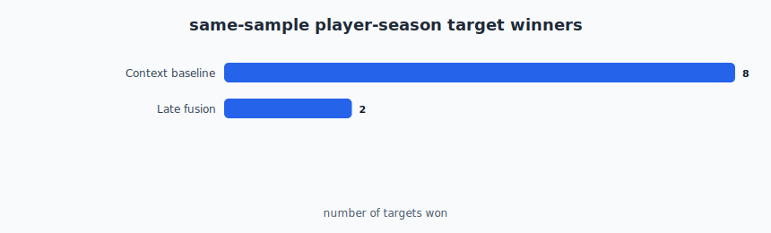

**図の読み方:** player-season の target 別勝者数です。event-level と違い、context/fusion/season prior が上位に出やすいです。これは年度成績が clip の瞬間映像だけでは決まりにくいことを示します。

player-season は event-level と違います。BA / OBP / SLG / OPS は単発打球ではなく年度集計です。今回の same-sample では context/fusion が強く、映像単独で season 成績を読むにはまだサンプル数と mechanics feature の質が足りません。ただし VLM の BA/OPS が一部良く見える箇所は n=37 の同一サンプルであり、caption collapse の影響もあるため強い結論にはできません。

## 9. VLM caption / tags の詳細検査

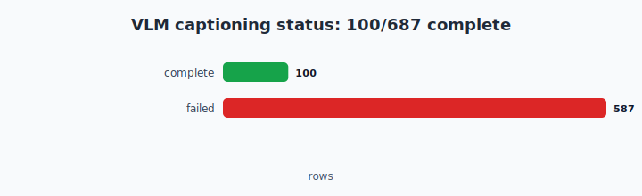

**図の読み方:** 687 rows のうち、Qwen VLM caption が complete したのは 100 rows だけです。VLMの数値結果はこの100本に依存しているので、研究上は `補助分析` として扱うべきです。

### 9.1 status

| status | rows | share |
| --- | --- | --- |
| vlm_failed | 587 | 85.4% |
| vlm_complete | 100 | 14.6% |

### 9.2 実際の caption 例

| clip | view | contact frame | caption | labels |
| --- | --- | --- | --- | --- |
| game744795_ab19_p2_no_play_id__game744795_ab19_p2_no_play_id_statsapi_view1__pre_contact_long__full_frame__orig | broadcast_infield | 261 | The batter demonstrates a balanced and efficient swing, with early contact timing and good hip rotation. | {"balance": "good", "bat_path": "straight", "contact_timing": "early", "load": "fast", "stance": "open", "stride": "short"} |
| game744796_ab11_p3_no_play_id__game744796_ab11_p3_no_play_id_statsapi_view1__pre_contact_long__full_frame__orig | broadcast_infield | 176 | The batter demonstrates a balanced and efficient swing, with early contact timing and good hip rotation. | {"balance": "good", "bat_path": "straight", "contact_timing": "early", "load": "fast", "stance": "open", "stride": "short"} |
| game744796_ab19_p4_no_play_id__game744796_ab19_p4_no_play_id_statsapi_view2__pre_contact_long__full_frame__orig | broadcast_infield | 272 | The batter demonstrates a powerful and precise swing, utilizing an open stance, fast load, short stride, and a straight bat path to achieve early contact. | {"balance": "good", "bat_path": "straight", "contact_timing": "early", "load": "fast", "stance": "open", "stride": "short"} |
| game744796_ab22_p5_no_play_id__game744796_ab22_p5_no_play_id_statsapi_view1__pre_contact_long__full_frame__orig | broadcast_infield | 268 | The batter demonstrates a powerful and efficient swing, utilizing a fast load and short stride to generate maximum bat speed and contact timing. | {"balance": "good", "bat_path": "straight", "contact_timing": "early", "load": "fast", "stance": "open", "stride": "short"} |
| game744796_ab68_p4_no_play_id__game744796_ab68_p4_no_play_id_statsapi_view2__pre_contact_long__full_frame__orig | broadcast_infield | 216 | The batter demonstrates a balanced and efficient swing, with early contact timing and good hip rotation. | {"balance": "good", "bat_path": "straight", "contact_timing": "early", "load": "fast", "stance": "open", "stride": "short"} |
| game744797_ab22_p2_no_play_id__game744797_ab22_p2_no_play_id_statsapi_view1__pre_contact_long__full_frame__orig | broadcast_infield | 414 | The batter demonstrates a powerful and precise swing, utilizing an open stance, fast load, short stride, and early contact timing to generate significant bat speed. | {"balance": "good", "bat_path": "straight", "contact_timing": "early", "load": "fast", "stance": "open", "stride": "short"} |
| game744797_ab46_p2_no_play_id__game744797_ab46_p2_no_play_id_statsapi_view1__pre_contact_long__full_frame__orig | broadcast_infield | 266 | The batter demonstrates a balanced and efficient swing, utilizing a fast load and early contact timing to generate power. | {"balance": "good", "bat_path": "straight", "contact_timing": "early", "load": "fast", "stance": "open", "stride": "short"} |
| game744797_ab5_p7_no_play_id__game744797_ab5_p7_no_play_id_statsapi_view1__pre_contact_long__full_frame__orig | broadcast_infield | 136 | The batter demonstrates a powerful and precise swing, utilizing an open stance, fast load, short stride, and a straight bat path to achieve early contact. | {"balance": "good", "bat_path": "straight", "contact_timing": "early", "load": "fast", "stance": "open", "stride": "short"} |

### 9.3 caption の偏り

| caption | rows | share of complete |
| --- | --- | --- |
| The batter demonstrates a powerful and precise swing, utilizing an open stance, fast load, short stride, and early contact timing to generate significant bat speed. | 19 | 19.0% |
| The batter demonstrates a balanced and efficient swing, with early contact timing and good hip rotation. | 16 | 16.0% |
| The batter demonstrates a powerful and precise swing, utilizing an open stance, fast load, short stride, and a straight bat path to achieve early contact. | 13 | 13.0% |
| The batter demonstrates a powerful and precise swing, utilizing an open stance, fast load, short stride, and early contact timing to generate maximum power. | 8 | 8.0% |
| The batter demonstrates a powerful and efficient swing, utilizing a fast load and short stride to generate maximum bat speed and contact timing. | 7 | 7.0% |
| The batter demonstrates a balanced and efficient swing, utilizing a fast load and early contact timing to generate power. | 7 | 7.0% |
| The batter demonstrates a balanced and efficient swing with an early contact timing, showcasing good hip rotation and a straight bat path. | 5 | 5.0% |
| The batter demonstrates a balanced and quick load, with an early contact timing that suggests good timing and control. | 3 | 3.0% |
| The batter demonstrates a powerful and efficient swing, utilizing an open stance, fast load, short stride, and early contact timing to generate maximum power. | 3 | 3.0% |
| The batter demonstrates a powerful and efficient swing, utilizing an open stance, fast load, short stride, and early contact timing to generate significant bat speed. | 2 | 2.0% |
| The batter demonstrates a powerful and precise swing, utilizing an open stance, fast load, short stride, and early contact timing to generate maximum bat speed. | 2 | 2.0% |
| The batter demonstrates a balanced and powerful swing with a late contact timing, showcasing good hip rotation and a straight bat path. | 2 | 2.0% |

### 9.4 tag の偏り

| label | value | rows | share of complete |
| --- | --- | --- | --- |
| balance | good | 98 | 98.0% |
| bat_path | straight | 98 | 98.0% |
| load | fast | 98 | 98.0% |
| stance | open | 98 | 98.0% |
| stride | short | 98 | 98.0% |
| contact_timing | early | 90 | 90.0% |
| contact_timing | late | 8 | 8.0% |
| balance | Good balance throughout | 2 | 2.0% |
| bat_path | Straight path to the ball | 2 | 2.0% |
| contact_timing | Early contact | 2 | 2.0% |
| stance | Slightly open stance | 2 | 2.0% |
| load | Quick and balanced load | 1 | 1.0% |
| stride | Short stride | 1 | 1.0% |
| load | Quick and balanced | 1 | 1.0% |
| stride | Short and quick | 1 | 1.0% |

今回の VLM は、ほとんどの complete row に似た mechanics を返しました。`balance=good`, `bat_path=straight`, `load=fast`, `stance=open`, `stride=short` がほぼ固定化しています。つまり、VLM が細かなフォーム差を十分に識別しているというより、一般的な良いスイング説明に寄っている可能性が高いです。

### 9.5 VLM caption と大きな予測ミス

| target | split | true | pred | abs error | caption |
| --- | --- | --- | --- | --- | --- |
| LA | train | -58.00 | 11.88 | 69.88 | The batter demonstrates a balanced and efficient swing, utilizing a fast load and early contact timing to generate power. |
| EV | train | 29.50 | 93.81 | 64.31 | The batter demonstrates a balanced and efficient swing, utilizing a fast load and early contact timing to generate power. |
| EV | validation | 34.20 | 93.88 | 59.68 | The batter demonstrates a balanced and efficient swing, with early contact timing and good hip rotation. |
| LA | train | -48.00 | 10.79 | 58.79 | The batter demonstrates a powerful and precise swing, utilizing an open stance, fast load, short stride, and early contact timing to generate significant bat speed. |
| LA | validation | -46.00 | 11.91 | 57.91 | The batter demonstrates a balanced and efficient swing, with early contact timing and good hip rotation. |
| EV | validation | 45.70 | 91.80 | 46.10 | The batter demonstrates a powerful and precise swing, utilizing an open stance, fast load, short stride, and early contact timing to generate significant bat speed. |
| xwOBA | train | 2.000 | 0.758 | 1.242 | The batter demonstrates a balanced and efficient swing with an early contact timing, showcasing good hip rotation and a straight bat path. |
| xwOBA | test | 2.000 | 0.762 | 1.238 | The batter demonstrates a balanced and efficient swing, with early contact timing and good hip rotation. |
| xwOBA | test | 1.885 | 0.697 | 1.187 | The batter demonstrates a powerful and precise swing, utilizing an open stance, fast load, short stride, and a straight bat path to achieve early contact. |
| Barrel | train | 1.000 | 0.180 | 0.820 | The batter demonstrates a powerful and precise swing, utilizing an open stance, fast load, short stride, and early contact timing to generate significant bat speed. |
| Barrel | train | 1.000 | 0.180 | 0.820 | The batter demonstrates a powerful and precise swing, utilizing an open stance, fast load, short stride, and early contact timing to generate significant bat speed. |
| Barrel | train | 1.000 | 0.181 | 0.819 | The batter demonstrates a powerful and precise swing, utilizing an open stance, fast load, short stride, and early contact timing to generate maximum bat speed. |
| Hard-hit | train | 0.000 | 0.678 | 0.678 | The batter demonstrates a powerful and efficient swing, utilizing a fast load and short stride to generate maximum bat speed and contact timing. |
| Hard-hit | train | 0.000 | 0.678 | 0.678 | The batter demonstrates a powerful and efficient swing, utilizing a fast load and short stride to generate maximum bat speed and contact timing. |
| Hard-hit | train | 0.000 | 0.678 | 0.678 | The batter demonstrates a powerful and efficient swing, utilizing a fast load and short stride to generate maximum bat speed and contact timing. |
| xBA | train | 0.079 | 0.580 | 0.501 | The batter demonstrates a balanced and efficient swing, utilizing a fast load and early contact timing to maintain good balance and hip rotation. |
| xBA | train | 0.063 | 0.547 | 0.484 | The batter demonstrates a balanced and efficient swing, with early contact timing and good hip rotation. |
| xBA | train | 0.077 | 0.549 | 0.472 | The batter demonstrates a powerful and efficient swing, utilizing a fast load and short stride to generate early contact timing. |

ここでいう caption は、人間が作った正解字幕ではありません。Qwen が出した mechanics caption です。v2 artifact には人間が検証した mechanics 正解ラベルがないため、「実際の字幕と比べて何が間違ったか」を厳密には評価できません。その代わり、caption が generic なまま大きく外した例を並べ、VLM が結果差を説明できていない可能性を見ています。

## 10. 既存図の読み方

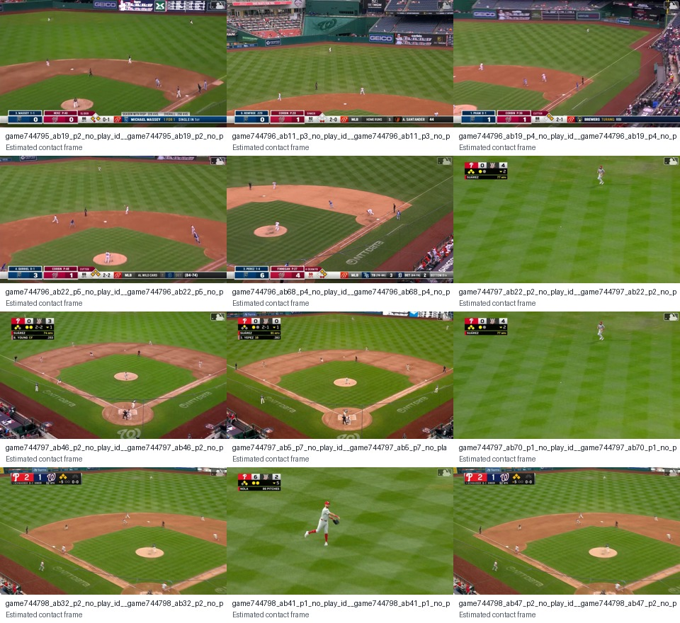

この sheet は、モデルが扱う contact frame の見た目を確認するためのものです。VLM も VideoMAE/R3D も raw broadcast 全体ではなく、contact-aligned clip を主入力にしています。

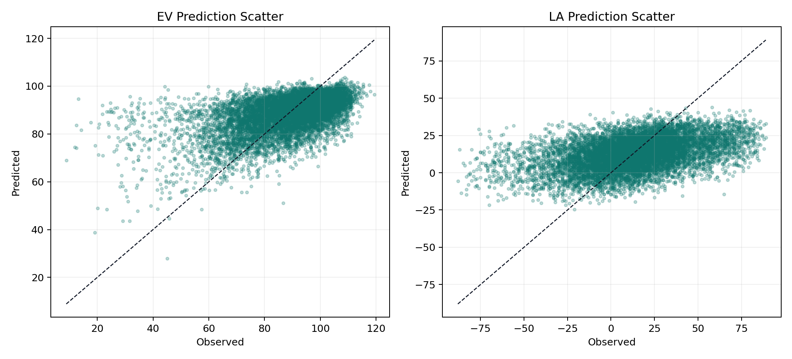

**図の読み方:** 横軸が実測、縦軸が予測です。点が対角線に近いほど良い予測です。EV/LA の scatter は、モデルが平均に寄りすぎていないか、大外しがどの範囲で出るかを見るための図です。

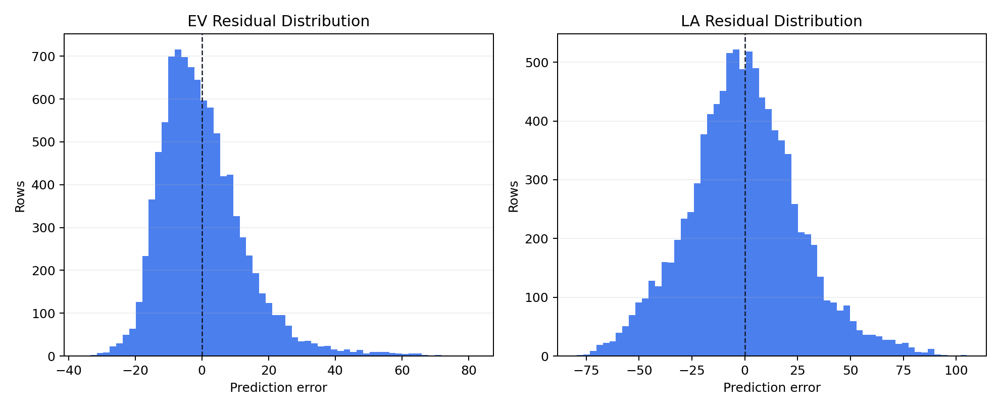

**図の読み方:** residual は `予測 - 実測` です。0 の周りに細く集まるほど良いです。片側に偏る場合は、モデルが全体的に高め/低めに予測している可能性があります。

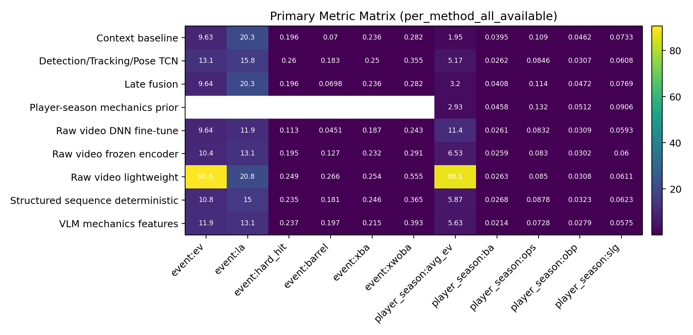

**図の読み方:** all-available の手法別 primary metric matrix です。coverage が大きく違うため、研究本文ではこの図だけで勝敗を決めず、same-sample heatmap とセットで読みます。

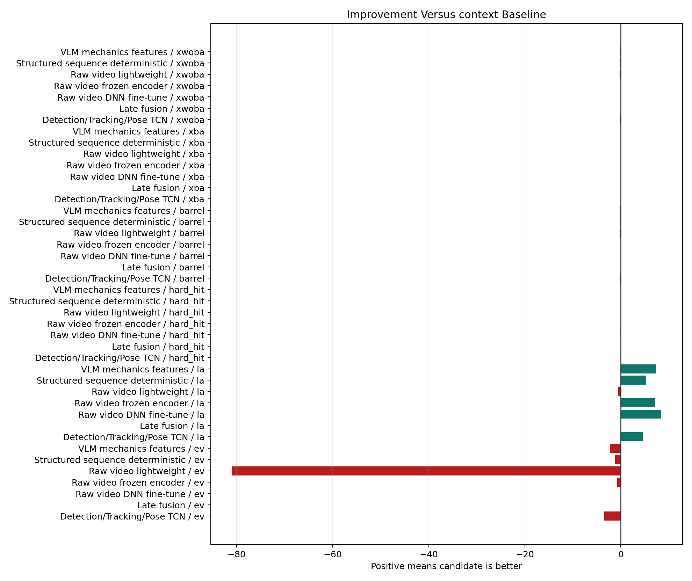

**図の読み方:** context baseline からどれだけ良く/悪くなったかを見る図です。映像系が context を超える target があれば、`動画を使う意味` の候補になります。

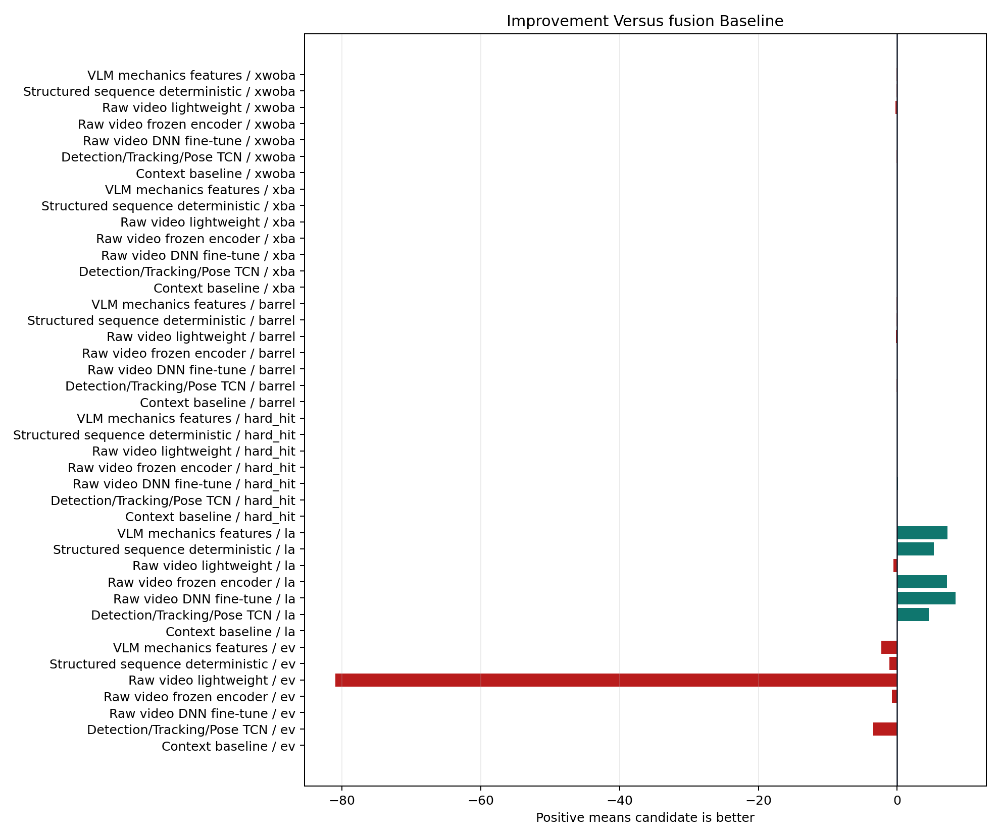

**図の読み方:** fusion と単独手法の差を見ます。fusion が弱い target では、固定重み平均が単独最良手法を薄めている可能性があります。

## 11. 研究上の注意点

### 11.1 all-available と same-sample を混ぜない

context は 27万 event 規模ですが、映像系は 600から700 event 程度、VLM は 100 clip だけです。all-available は運用上の coverage を見る表、same-sample は純粋な手法比較を見る表です。

### 11.2 fusion は万能ではない

今回の fusion は validation で重みを学習していません。context がある大多数の row では context に近い挙動になります。video 系だけの改善を見たい場合は、fusion 全体の平均より、same-sample と fusion input audit を見ます。

### 11.3 pose はまだ batter mechanics と言い切れない

debug overlay で skeleton がピッチャー側に付くケースがありました。これは pose feature がバッター動作ではなく投球動作を拾う危険を意味します。次版では batter detector / right-side crop / plate-relative selection が必要です。

### 11.4 VLM は小さく、generic

VLM complete は 100 rows です。さらに fps validation error の履歴が error column に残っており、video reader まわりの不安定性があります。VLM caption を研究の主張に使うなら、少なくとも数百から千 rows、かつ人間の mechanics annotation との比較が必要です。

## 12. 次にやるべき改善

1. batter-centered crop と pose association を入れる。
2. VLM は clip 全体ではなく batter crop + contact frame + slow sampled frames の複数入力で再実験する。
3. VLM caption を固定ラベルに落とす前に、caption diversity と human spot check を report に入れる。
4. fusion weights を validation で学習する版と固定重み版を分けて比較する。
5. raw video fine-tune を最有力として、clip数を増やし、A100で batch/epoch を拡張する。
6. same-sample を主要表にし、all-available は coverage 表として扱う。

## 13. Appendix: class diagram

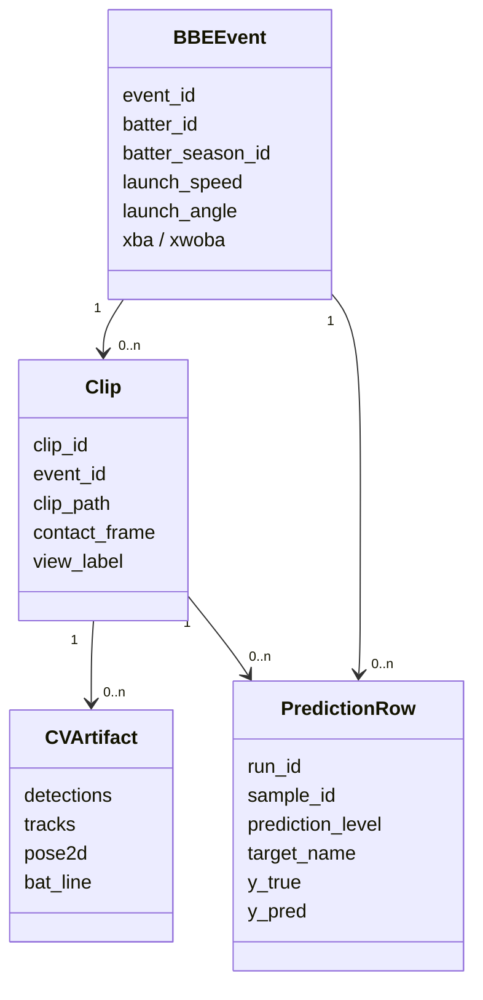
```mermaid
classDiagram
  class BBEEvent {
    event_id
    batter_id
    batter_season_id
    launch_speed
    launch_angle
    xba / xwoba
  }
  class Clip {
    clip_id
    event_id
    clip_path
    contact_frame
    view_label
  }
  class CVArtifact {
    detections
    tracks
    pose2d
    bat_line
  }
  class PredictionRow {
    run_id
    sample_id
    prediction_level
    target_name
    y_true
    y_pred
  }
  BBEEvent "1" --> "0..n" Clip
  Clip "1" --> "0..n" CVArtifact
  Clip "1" --> "0..n" PredictionRow
  BBEEvent "1" --> "0..n" PredictionRow
```
